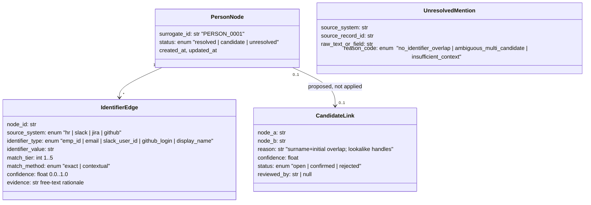

# Architecture — Production-Scale Identity Resolution, De-identification & Decision-Unit Pipeline

*Internal working doc. Describes the system as LH2 would run it in production, using the Acme
sample data as the worked example. Builds on `requirements_analysis.md`.*

## 1. System overview

```mermaid
flowchart LR
    subgraph Sources
        HR[HR roster\nCSV]
        SL[Slack export\nJSON]
        JI[Jira export\nJSON]
        GH[GitHub export\nJSON]
    end

    subgraph Ingest["1. Ingest & Normalize"]
        NORM[Per-source normalizers\n-> canonical Mention/Event records]
    end

    subgraph Resolve["2. Identity Resolution"]
        GRAPH[(Identity Graph /\nCrosswalk store)]
        DET[Deterministic\nmatcher: tiers 1-4]
        CTX[Contextual / fuzzy\nmatcher: tier 5]
        REVIEW[[Human review queue:\nunresolved + candidate-links]]
    end

    subgraph Deid["3. De-identification"]
        SUB[Structured-field\nsubstitution]
        SCRUB[Free-text scrubber\n(graph-seeded + NER fallback)]
    end

    subgraph Assemble["4. Decision-Unit Assembly"]
        JOIN[Cross-source event join]
        POLICY[[Sell-safety policy engine]]
        UNIT[Decision-unit object]
    end

    HR --> NORM
    SL --> NORM
    JI --> NORM
    GH --> NORM
    NORM --> DET
    DET --> GRAPH
    DET -->|below floor| CTX
    CTX --> GRAPH
    CTX -->|still below floor| REVIEW
    DET -->|candidate-link, no shared ID| REVIEW
    GRAPH --> SUB
    GRAPH --> SCRUB
    NORM --> SUB
    NORM --> SCRUB
    SUB --> JOIN
    SCRUB --> JOIN
    JOIN --> POLICY
    POLICY --> UNIT
    POLICY -->|rejected| DROP[["Dropped, logged\n(not sold)"]]

    GRAPH -.private, access-controlled.-> VAULT[(Crosswalk vault)]
```

The pipeline is deliberately **not** a single linear script in production: Resolution produces a
durable, queryable Identity Graph that both De-identification and Assembly read from independently.
This is what makes NFR-1 (determinism/idempotency) and the "recompute only what's affected" scale
requirement (§6 of the requirements doc) possible — a correction to the graph doesn't require
re-deriving it from scratch.

## 2. Identity Resolution subsystem

### 2.1 Data model — the identity graph



`PersonNode` is only created once a mention clears the confidence floor (tier 1-4 exact match, or
tier 5 contextual match with recorded corroboration) — note this includes thinly-attested HR rows
with only one identifier on file (e.g. a Slack-only contractor row), which are still real,
deterministically-matchable nodes, just sparse ones. Everything below the floor becomes an
`UnresolvedMention` — a first-class record, not a dropped row. `CandidateLink` exists specifically to
hold the three-way "Alex/Kumar" cluster (requirements doc §4.2): three nodes, pairwise documented
resemblance, zero applied merges, all routed to `REVIEW`.

### 2.2 Matching algorithm

1. **Seed nodes from HR.** Each HR row becomes one `PersonNode` with one `IdentifierEdge` per
   non-blank field (tiers 1-4 per FR-3). Blank fields contribute no edge.
2. **Deterministic pass over every other source.** For each mention's extracted identifier
   (structured field first — `assignee_email`, `user`, `author`, `commits[].author` — see §3.1 for
   extraction), look up exact match against existing edges, in tier order. A hit adds an
   `IdentifierEdge` to that node at the matched tier. No hit at any tier → passed to the contextual
   pass.
3. **Contextual pass** for name-only / ambiguous mentions: gather candidate nodes whose
   `display_name` matches; require at least one corroborating signal (same channel + a same-channel
   self-identifying message from one specific candidate within a bounded time window, or unambiguous
   team-topic alignment); score confidence down from a full-identifier match; if exactly one candidate
   clears the corroboration bar, add a tier-5 `contextual` edge; if more than one clears it, or none
   do, emit `UnresolvedMention`.
4. **Resemblance check, independent of the above.** Separately from resolving mentions, run a
   blocked (not full O(n²) — see §6) similarity pass across `PersonNode`s themselves (name/handle
   edit-distance, shared substrings like `akumar-*`) to surface `CandidateLink`s for review. This
   never auto-merges.
5. **Surrogate assignment.** Every node with ≥1 identifier edge gets a stable surrogate ID, assigned
   once at first creation (monotonic counter or ULID-style, never derived from PII — NFR-6) and
   never reassigned. Critically, "first creation" is a lookup against the *persisted* identity
   registry, not a fresh enumeration of the current HR snapshot — see §7.1, which documents a real
   bug this distinction fixed.

### 2.3 Human review loop

`UnresolvedMention`s and `CandidateLink`s feed a review queue, prioritized by downstream impact
(reused across many records > isolated mention). A confirmed review outcome is written back as either
a new `IdentifierEdge` (mention resolved) or a `CandidateLink.status = confirmed` (nodes merged — the
*only* path by which two HR rows ever become one surrogate) or `rejected` (stays split, permanently
annotated so the same resemblance doesn't re-surface every run). This is the sole merge path in the
system — there is no automated code path that merges two `PersonNode`s.

## 3. De-identification subsystem

### 3.1 Structured-field substitution
Per-source field maps (config, not code, so adding a source is a config change):
- Slack: `user` → surrogate.
- Jira: `assignee_email`, `comments[].author` → surrogate.
- GitHub: `author` (parsed as `"Name <email>"` or bare handle), `commits[].author` → surrogate.

### 3.2 Free-text scrubbing
Seeded from the identity graph: every known identifier (all display-name variants, emails, handles)
for every resolved `PersonNode` becomes a literal match pattern applied to message bodies, comment
bodies, PR titles, and commit messages, replaced with that node's surrogate. Unresolved-mention raw
text (e.g. "Alex K.") is replaced with a generic `[UNRESOLVED_PERSON]` placeholder — visibly redacted,
never silently left as PII and never mapped to a guessed surrogate (FR-8). At production scale, a
general NER pass runs *after* the graph-seeded pass as a second-pass detector for names not yet in
the graph (new hires, typos) — any NER hit not already resolved is treated as a hard-stop for review,
not an auto-redaction, since NER has a nontrivial false-positive/negative rate and shouldn't silently
create new placeholder classes.

### 3.3 Consistency guarantee
Because both structured and free-text substitution read from the *same* identity graph snapshot, and
because surrogate IDs are immutable once assigned (NFR-1), the same person maps to the same surrogate
across all three de-identified outputs by construction, not by cross-checking after the fact.

## 4. Decision-Unit Assembly subsystem

### 4.1 Approach
Event-sourcing style join: pull every normalized event that shares a cross-system correlation key
(here, the issue key `PAY-123`, discoverable via Jira issue key ↔ Slack text mention ↔ PR
title/commit message reference), order by timestamp, tag each with its de-identified participants and
role, and attach a citation (`source_system`, `source_record_id`) to every event.

### 4.2 Sell-safety policy engine
Runs **before** an event is admitted into a decision unit, independent of and in addition to
de-identification:
- `channel_visibility != "public"` → excluded.
- `export_eligible == false` (where present) → excluded.
- Content-level confidentiality signals (customer name + dispute/legal language + explicit
  "keep quiet" instruction) → excluded, even if visibility/export flags don't independently catch it.
  This is a rule-based detector at this scale (§5 of requirements doc), acknowledged as a coarse net
  that would need a proper classifier at volume.

Every exclusion is logged with its reason — the decision unit's construction is itself auditable,
mirroring NFR-3.

### 4.3 Output shape
Sellable object (`decision_unit_pay123.json`) — no excluded content, no raw rejected text anywhere
in it:
```json
{
  "decision_unit_id": "DU_PAY-123",
  "summary": "string, human-authored or templated, PII-free",
  "timeline": [
    {"ts": "...", "event_type": "slack_message|jira_status|pr_opened|pr_merged|commit",
     "actor": "PERSON_000x | null", "role": "reporter|assignee|reviewer|author|contributor",
     "citation": {"source_system": "...", "record_id": "..."}}
  ],
  "participants": [{"surrogate_id": "PERSON_000x", "roles": ["..."]}]
}
```
Internal-only audit object (`decision_unit_pay123.internal_audit.json`, separate file, same access
tier as the identity crosswalk): `{"decision_unit_id": "...", "excluded_events": [{"citation": "...",
"reason": "private_channel|customer_confidential_content|export_ineligible", "note": "raw text"}]}`.
Keeping excluded content as a *field on the sellable object* was an early draft mistake — the
excluded raw text (e.g. the Globex dispute note) would still ship inside the file being called
sellable, defeating the purpose. Physically separating the files is what actually enforces
"include only what is safe to sell."

## 5. Governance & privacy

- **Storage separation (NFR-5):** the identity graph / crosswalk lives in a separate store from
  de-identified product tables, with its own access policy (need-to-know: resolution engineers and
  the review queue, not data-product consumers or most of the org).
- **Audit logging:** every write to the identity graph (new edge, new candidate-link, review
  decision) and every policy-engine exclusion is logged with actor (system/human), timestamp, and
  rationale.
- **Retention:** raw source data retained only as long as needed to support review/correction
  propagation; the crosswalk retained as long as any product derived from it is still being sold
  (needed to honor corrections); a right-to-erasure request removes a `PersonNode` and triggers
  reprocessing of every dependent output (see §6, "reprocessing cost of corrections").
- **Encryption at rest** for the crosswalk store specifically, since it is the highest-value
  re-identification target in the whole system.

## 6. Scale ("what breaks at 1000x")

See `requirements_analysis.md` §6 for the full analysis. Architecturally, the responses are:
- **Blocking/indexing** before any contextual or resemblance scoring (by team, channel, time window,
  name prefix) to avoid O(n²) comparison.
- **Prioritized, impact-ranked review queue** rather than FIFO, so human throughput is spent on the
  unresolved items that touch the most downstream product records.
- **Second-pass general NER**, reconciled against the graph, layered on top of the closed
  dictionary/regex scrub, to bound the false-negative growth of free-text scrubbing.
- **Dependency-tracked incremental recompute**: every output record records which `PersonNode`s it
  depends on, so a correction (candidate-link confirmed/rejected, new edge added) triggers a targeted
  re-emit instead of a full pipeline rerun.
- **Per-tenant partitioning** of the identity graph and crosswalk store, since production LH2 serves
  many source organizations, not one.

## 7. Delta / incremental ingestion

Everything above is described against one static snapshot of `sample_data/`. Production LH2 never
gets that: sources are continuously appended to (new Slack messages, new Jira comments, new
commits) and the roster itself changes (new hires, a contractor converted to an employee, a
corrected email). Reprocessing the full corpus on every run is wasteful, and — this is the part
worth being honest about — a naive "just re-run resolution over the current full snapshot every
time" implementation can silently break NFR-1's stability promise the moment the *order* or
*contents* of the authoritative source change between runs. This section exists because that
wasn't hypothetical: it was a real bug in this codebase (§7.1), found by asking "have you actually
thought about delta ingestion?" rather than by a test — which is itself the argument for writing
this section down.

### 7.1 Stable identity must not depend on position

The first implementation of `build_nodes()` assigned surrogate IDs by CSV row index:
`PERSON_{i:04d}` for the i-th row of `hr_directory.csv`. That satisfies the *letter* of NFR-1
("rerunning on unchanged input produces identical output") but not its *purpose*, because it's
only stable if the roster file itself never reorders and new rows only ever get appended at the
end. In practice:
- A new hire inserted anywhere but the end of the file shifts every surrogate ID after it.
- A re-export of the roster in a different row order (alphabetical resort, a new HRIS vendor)
  reshuffles every ID.
- There was no persisted identity graph at all — every run rebuilt the graph from scratch from
  whatever HR snapshot was handed to it, so "the graph" and "this run's HR file" were the same
  thing, which is exactly what makes delta ingestion impossible.

**Fix:** a persisted identity registry (`output/identity_registry.json`), consulted on every run
instead of positional enumeration. Each HR row is looked up against the registry using the *same*
tiered-trust order already used for mention matching — `emp_id` → `work_email` → `slack_handle` →
`github_login` — reusing existing infrastructure rather than inventing a parallel matching scheme.
The first tier that hits an existing registry entry reuses that entry's surrogate ID; the row also
*enriches* that entry with any previously-unknown field it newly carries (e.g. a contractor row
that later gains a `work_email`), so future runs have more to match on, not less. Only a row that
matches nothing in the registry mints a new sequential ID, which is appended — never inserted,
never reassigned.

Rows with **no strong identifier at all** (blank `emp_id`/`work_email`/`slack_handle`/
`github_login` — theoretically possible even though nothing in the current sample is *that* sparse)
fall back to a `(display_name, team)` key, explicitly labeled `weak fallback` wherever it's used.
This is a named, acknowledged limitation, not a solved problem: a `(name, team)` match cannot
actually distinguish "the same sparse contractor reappearing in a later export" from "a new,
different contractor who happens to share a name and team." There is no way to guarantee identity
continuity for a person with zero durable identifiers across separate ingestion runs — the honest
answer is that such a row needs a human to confirm continuity, same as any other candidate-link.

### 7.2 Per-source watermarks

Each source needs a cursor tracked independently — last-processed Slack `ts` per channel, last
Jira `updated` timestamp per issue, latest known commit SHA per PR/branch — so a delta run pulls
only new-or-changed records instead of re-reading the full corpus to find them. This is standard
CDC/watermark territory and isn't specific to identity resolution; it's what makes "only new
records get processed" possible upstream of everything described here.

### 7.3 Three delta cases, not one

Treating "new data arrived" as a single case hides that the three ways it can arrive have very
different costs:

1. **A new mention of an already-resolved person.** Cheap: match the new record against the
   existing registry/graph, append an `IdentifierEdge`. No history is touched.
2. **A new mention that resolves something previously ambiguous.** `UnresolvedMention`s and open
   `CandidateLink`s are not dead ends — they're pending state. A **retry queue** re-evaluates them
   against the current graph on every delta cycle, because a later message can supply exactly the
   corroborating context a bare-name mention needed (this is the same mechanism §2.2 step 3 already
   uses, just re-run incrementally instead of once).
3. **An HR roster change that alters identity itself** — a contractor row gains an email, or a
   human reviewer confirms a `CandidateLink` (§2.3). This can retroactively change the *meaning* of
   past mentions, which is the one case that genuinely requires the "dependency-tracked incremental
   recompute" already named in §6: every output record needs to know which surrogate(s) it depends
   on, so a graph mutation triggers a bounded, targeted regeneration of just the affected
   de-identified records and decision units — logged like any other resolution change (NFR-3),
   never silent, and never a full reprocess.

### 7.4 Candidate-link re-scoring is cheap by construction — worth noticing, not just assuming

`candidate_links()` (§2.2 step 4) runs over the set of *people* (small, slow-growing), not the set
of *messages* (large, fast-growing). O(n²) over 10,000 people is fine to re-run on every delta
cycle in full; O(n²) over 10M messages is not. This is a property of how the resemblance check was
scoped, not an accident — it's the reason mention-matching needs blocking/indexing at volume (§6)
while candidate-link re-scoring doesn't.

### 7.5 Decision units are living objects, not one-shot snapshots

`DU_PAY-123` could gain a new event next week (a regression, a reopened issue, a hotfix PR). A
delta-aware assembler needs to recognize "this new event correlates with an existing decision
unit" and **version** it (`DU_PAY-123` v2, with a changelog of what was added) rather than either
ignoring the new event or silently mutating an object that may already have been sold. This isn't
implemented in this take-home (there's only one snapshot of PAY-123 to assemble), but it's a direct
consequence of treating decision units as append-only history rather than a point-in-time query.

### 7.6 Deletions and edits need tombstones, not just additions

A deleted Slack message or an edited Jira comment has to propagate as a retraction. The append-only
framing above (new mentions, new events) doesn't cover this at all — a genuinely complete delta
design needs a tombstone/supersede record type, which would itself need to trigger the same
dependency-tracked re-emit as an identity-graph correction (§7.3 case 3), since a retracted source
record can invalidate a de-identified record or a decision-unit event derived from it.

### 7.7 What's actually implemented here vs. still just designed

To keep this honest: §7.1 (registry-backed, position-independent surrogate IDs) is implemented in
`resolve_entities.py` and covered by a regression test that reorders `hr_directory.csv` and inserts
a new hire mid-file across two separate persisted runs, asserting existing people keep their IDs
and only the new hire gets a new one. §7.2–§7.6 remain design-only in this take-home — the sample
data is one static snapshot, so there's nothing to build a watermark or a retry queue against yet.
They're written down here so the next increment has a target, not because they're claimed to be
built.

## 8. Worked walkthrough — PAY-123 through every subsystem

1. **Ingest/Normalize:** Slack messages in `payments`/`legal-ops`/`legal-sensitive`, the Jira issue
   `PAY-123` and its two comments, GitHub PR #88 and its two commits, all become normalized
   Mention/Event records tagged with their source and raw identifiers.
2. **Resolve:** `U123ALICE`→Alice Chen (tier 3, deterministic), `alice.chen@acme.com` in Slack body
   and Jira assignee and PR author string → Alice Chen (tier 2), `achen` commit author → Alice Chen
   (tier 4), `U330PRIYA`→Priya Nair (tier 3), bare "Priya" in the payments channel → Priya Nair
   (tier 5, contextual, corroborated by the same-channel `U330PRIYA` follow-up), `U510JORDAN`→Jordan
   Lee (tier 3), `U441PRIYA`→Priya Shah (tier 3) with "Priya Shah" free-text signature confirming
   (tier 2/name), bare "Priya" in legal-ops → Priya Shah (tier 5, contextual), `alex.kumar@acme.com`
   Jira comment → Alex Kumar (tier 2), `akumar@gmail.com` commit author → **A. Kumar contractor node**
   (tier 2, deterministic — *not* Alex Kumar; see requirements doc §4.2), `UNK_ALEXK` "Alex K." self-
   intro → its **own thin HR node** (tier 3, deterministic match on the HR-assigned Slack handle —
   see requirements doc §4.3), *not* unresolved and *not* merged into either Kumar. Three pairwise
   `CandidateLink`s (Alex Kumar ↔ "Alex K.", Alex Kumar ↔ A. Kumar, "Alex K." ↔ A. Kumar) are
   recorded, all unconfirmed, all routed to review.
3. **De-identify:** every field and free-text mention above is rewritten to its surrogate;
   `UNK_ALEXK`'s message becomes `[UNRESOLVED_PERSON] here from the contractor side...`.
4. **Assemble:** the timeline joins Slack report → Jira triage/assignment → review comment → PR
   open/merge → commits, with citations to each raw record. The `legal-sensitive` message (Priya
   Shah, private channel, naming customer "Globex" mid-dispute) is **excluded** by the policy engine
   on two independent grounds (`channel_visibility: private` and customer-confidentiality content
   signal) and appears only in `excluded_events` for internal audit — never in the sellable unit.
